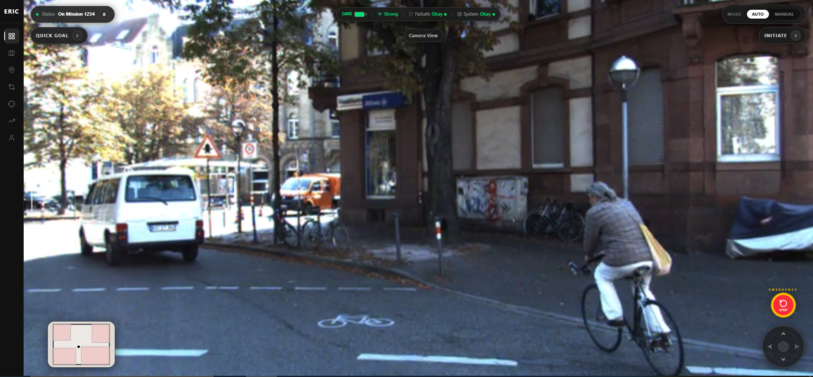
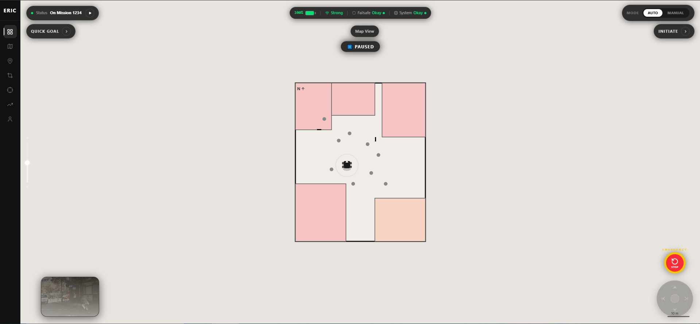
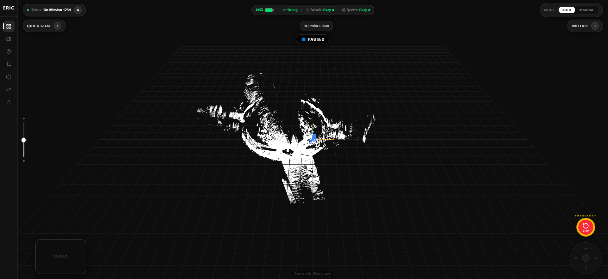

# Insight.IO

**Name:** Malvika  
**Email:** malvikaa27@gmail.com  
**Contact:** +91 8076618092

---


A robot operations dashboard built for the ERIC Robotics internship assignment. The goal was to faithfully recreate the Insight.IO UI from a provided demo — a dark-themed, full-bleed dashboard where camera, map, and LiDAR views sit beneath a floating control layer.

---

## Overview

The dashboard has three main views that cycle via a thumbnail pip in the bottom-left corner:

- **Camera** — real footage from the KITTI autonomous driving dataset, playing as a continuous feed
  


- **Map** — a 2D floor plan with a robot marker that moves in real time as you use the joystick
  


- **Point Cloud** — a 3D LiDAR scan from the same KITTI sequence, rendered with Three.js and draggable to orbit
  


Controls float over whichever view is active — a status bar at the top, a circular joystick and emergency stop at the bottom-right, and a zoom slider on the left edge.

The sensor data (camera footage and point cloud) comes from KITTI drive `2011_09_26_0005` — a short city driving sequence. The raw `.bin` velodyne scans were converted to `.pcd` using a custom Python script, and the image frames were stitched into an MP4 using ffmpeg.

---

## Running locally

```bash
git clone https://github.com/malvika270/insight_io_dashboard.git
cd insight_io_dashboard
npm install
npm run dev
```

Open [http://localhost:5173](http://localhost:5173)

**Requirements:** Node.js 18+

---

## Recreating the data (optional)

If you want to regenerate the sensor files from raw KITTI data:

1. Download `2011_09_26_drive_0005_sync` from [KITTI Raw Data](http://www.cvlibs.net/datasets/kitti/raw_data.php)

2. Convert LiDAR scans to PCD:
```bash
python scripts/bin_to_pcd.py <path-to-velodyne/data/> public/pointcloud.pcd --frames 5
```

3. Convert camera frames to MP4:
```bash
ffmpeg -framerate 10 -i "<path-to-image_02/data/>%010d.png" \
  -vf "scale=1242:374,format=yuv420p" -c:v libx264 -crf 23 \
  -preset fast -movflags +faststart public/camera-feed.mp4
```

---

## Controls

| | |
|---|---|
| Minimap (bottom-left) | Cycle between Camera, Map, and Point Cloud |
| Joystick / Arrow keys | Move robot marker on the 2D map |
| Zoom slider (left edge) | Zoom map or point cloud |
| Emergency Stop | Freeze movement, trigger alert overlay |
| MODE toggle | Switch between AUTO and MANUAL |

---

## Data Attribution

> A. Geiger, P. Lenz, C. Stiller, R. Urtasun. *Vision meets Robotics: The KITTI Dataset.* IJRR, 2013.
